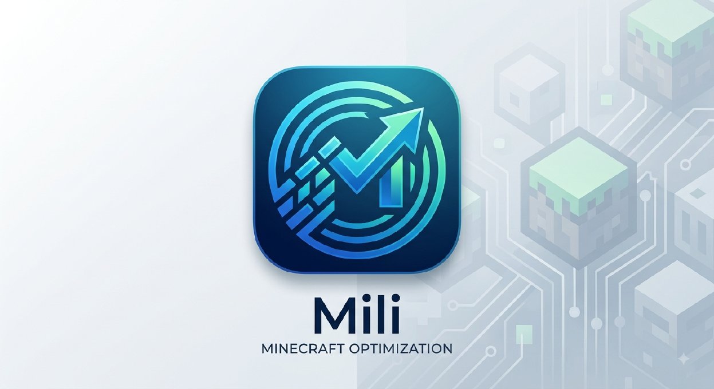

<p align="center">
  
</p>

<h1 align="center">LMili（米粒）</h1>

<p align="center">
  <strong>基于 Folia 的高性能 Minecraft 服务端核心：更纯粹的区域多线程体验，更多 API，更稳定</strong>
</p>

<p align="center">
  <a href="./README.md">中文</a> | <a href="./README_EN.md">English</a>
</p>

<p align="center">
  
  
  
</p>

---

## 项目简介

LMili 是一个基于 **Paper → Folia** fork 链的 Minecraft 服务端核心。项目目标是成为一个**纯粹的 Folia**：不引入生电/红石机制修改与客户端协议魔改，专注于在 Folia 区域多线程调度模型之上提供 **更多 API、稳定性修复与 bug 修复**，以及通用的性能优化。

### 继承链

```
Minecraft（原版）
  └── Paper（服务端框架）
        └── Folia（区域多线程调度）
              └── LMili（本项目）
```

> LMili 现为直接基于 Folia 的服务端，包名 `fun.bm.mili.lmili`。

### Mili 与 LMili 的命名关系

本项目存在"Mili"与"LMili"两套命名，二者指向不同产品：

| 层面 | 名称 | 说明 |
|------|------|------|
| 品牌 / 产品名 | Mili | 用户面对的产品简称 |
| GitHub 仓库 | `MiliMCL/LMili` | 代码托管地址 |
| 服务端核心 JAR | `lmili-26.2-paperclip.jar` | 可运行的服务端产物 |
| Maven 发布坐标 | `io.github.xucy10:lmili-api:26.2-R0.1` | 插件开发引用坐标 |
| Gradle 模块 | `lmili-api` / `lmili-server` | 见 `settings.gradle.kts` |
| 公共 API 包 | `fun.bm.mili.api` | 插件开发 import 的包名 |
| 内部实现包 | `fun.bm.mili.lmili.*` | 服务端核心实现（调度器、配置等） |
| 配置文件 | `lmili_config.toml` | 服务端主配置文件 |

> **历史背景**：LMili 前身包含 Luminol 品牌代码。执行 rebrand 后，底层包名从 `me.luminolmc.*` 迁移至 `fun.bm.mili.lmili.*`。

---

## 插件开发文档

[插件开发文档](docs/LMili核心插件开发指南.md)

---

## 核心特性

### Parallel Simulation Runtime — 并行模拟运行时

LMili 最新的架构创新。从 Folia 并行 Tick 优化核心演进为完整的并行模拟运行时，提供严格并发语义、生命周期管理、依赖调度和动态负载均衡。

#### P0: Tick Generation 生命周期

- **状态机**：CREATED → RUNNING → DEADLINE_EXCEEDED → DRAINING → COMPLETED/CANCELLED
- **Generation ID 单调递增**：任务必须捕获创建时的 generation
- **Late Completion 隔离**：旧 generation 任务无法影响新 generation
- **超时 ≠ 任务停止**：cancel(true) 是 interrupt request 仅此而已
- **Draining 状态**：已进入 draining 的任务仍可完成，但新任务无法提交

#### P1: Unified Scheduler Runtime

- **统一任务抽象** `RuntimeTask`：所有任务统一接口，包含 taskId、regionId、generationId、deadline、priority、state
- **Work Stealing with LocalDeque**：LIFO 本地执行 + FIFO 窃取，使用 `AtomicStampedReference` 防止 ABA 问题
- **Deadline Scheduler**：`deadline = previousDeadline + tickIntervalNanos`，防止 Tick 漂移
- **Dynamic Slice Cost**：加权计算 entity/blockEntity/scheduledTick 数量，EWMA 预测
- **Adaptive Slicing**：目标 ~2-4ms estimated work per slice（非固定 chunks/slice）
- **Worker Utilization 可观测**：忙碌/空闲时间、窃取统计、队列深度追踪

#### P2: Dependency-aware Tick DAG

- **Region 所有权系统**：每个对象必须有明确 Owner，非 Owner 线程不得直接修改 Region state
- **跨 Region 消息**：通过 `CrossRegionMessage` + `RegionMailbox` 实现安全通信
- **并行冲突检测器**：7 种冲突类型检测（CROSS_REGION_ACCESS、SHARED_OBJECT_ACCESS 等）
- **运行时全指标**：TPS、MSPT、P50/P95/P99、Queue Size、Worker Utilization、Steal Count、Late Completion Count

#### P3: Entity Parallel Simulation

- **分阶段 Entity Tick**：AI → Movement → Sensors → Collision → Brain → Commit
- **Entity 依赖图**：表达实体间碰撞、骑乘、攻击等依赖关系
- **拓扑排序执行**：保证依赖关系前提下最大化并行度

### RegionTickPool — 独立 tick 调度增强

LMili 经典的架构创新。将 Folia "每区域独占一线章"的模型替换为**共享 worker 池 + 优先级调度**，显著减少大量空闲 region 时的 CPU 占用。

- **Virtual Thread 后端**：基于 JDK 25 虚拟线程，以同步风格编写异步逻辑，`awaitCrossRegion` 跨区挂起不阻塞平台线程
- **DAG 并行调度**：`DagExecutionEngine` 非阻塞回调驱动，`CompiledDag` 不可变编译后 DAG，`ConflictGraph` 稀疏冲突图替代 O(n²) 矩阵
- **Work-Stealing 负载均衡**：`WorkStealingCoordinator` 全局工作窃取，自动平衡各 region 负载
- **阻塞操作隔离**：`BlockingTaskIsolation` 专用平台线程池 + 信号量限流，防止 carrier pinning
- **对象池复用**：`ExecutionContext` + `ObjectPool` ThreadLocal 池，热路径零分配
- **渐进式迁移**：通过 `RegionTickDispatcherAdapter` 桥接新旧路径，`use-new-scheduler` 灰度开关控制

执行模式根据区域 chunk 数量自动选择：
- 小 region（chunk 数 < 阈值）：单线程同步执行（无调度开销）
- Virtual Thread 模式：chunks 拆分为 slices，每个 slice 一个 virtual thread 并行
- Platform Thread 模式：贪心负载均衡分发给固定 worker 队列

> 启用 RegionTickPool 后会自动禁用 RegionBalancer — 两者互不共存。

### Folia 稳定性修复

- **Region Balancer**：共享线程池 + 优先级队列替代 Folia 每区域独占线程，动态负载均衡（RegionTickPool 的前身）
- **Region Load Monitor**：无锁滑动窗口统计区域 tick 耗时
- **Adaptive TPS Manager**：根据实时负载动态调整 TPS
- **Cross-Region Helper**：类型化跨区事件队列（实体伤害、方块通知等）
- **RegionTaskIdRegistry**：全局 UUID 注册中心，防止跨区块任务 ID 碰撞导致崩溃
- **全局实体计数器**：按区域聚合 mob 数量，避免 O(entities) 扫描
- **线程安全加固**：全局 `catch(Exception)` → `catch(Throwable)` 修复，防止 OOM/StackOverflow 等 Error 导致调度器线程静默死亡

### Bug 修复

大量针对 Folia 区域线程模型的修复，包括（但不限于）：

- 玩家重生位置修正、实体传送（跨区/末影珍珠/维度切换）一系列竞态修复
- 区域外寻路/拴绳/目标选择防护
- POI 更新延迟、区块重载检测、龙部件同步等修复
- RegionizedTaskQueue 并发引用修正
- `RegionizedWorldData` 空连接 NPE、已移除实体仍添加效果、`/save-all` 区域安全化

### 通用性能优化

来自 Gale / Lithium / Pufferfish / SparklyPaper / Kaiiju / Petal / Krypton / Leaves 等上游的通用优化（不涉及生电行为修改），例如：

- 噪声生成、AI 属性集合、大脑映射、准则映射等数据结构优化
- 实体移动零位移跳过、可变实体唤醒时长、canSee 检查优化
- 区块加载查找削减、投射物区块加载削减、寻路区域限制
- 网络与协议层优化、区块增量压缩
- 村民 lobotomize（发呆）优化、传感器工作削减
- 异步寻路、动态视距、实体数据脏追踪、CPU 亲和性、SIMD 优化

### API 扩展

在 Folia/Paper API 之上提供更多能力：

| API | 说明 |
|------|------|
| **Mili 调度器 API** | 挂起式调度器（`Mili`、`Scheduler`、`EntityScheduler`、`EntityTaskContext`），以 virtual thread 为后端，支持 `awaitCrossRegion` 跨区挂起 |
| **Tick Regions API** | 查询/操作 tick 区域的 API（`ThreadedRegionizer`、`ThreadedRegion`、`TickRegionData`、`RegionStats`） |
| **ReplayMod 摄影师** | 创建 ReplayMod 摄影师实体进行录像，`Photographer` / `PhotographerManager` API |
| **Bytebuf API** | 面向插件的自定义数据包读写 API（Netty 风格，独立于 NMS） |
| **数据包事件** | `PacketInEvent` / `PacketOutEvent` 监听数据包收发，可取消 |
| **实体传送异步事件** | `EntityTeleportAsyncEvent`、`PreEntityPortalEvent`、`PostEntityPortalEvent` |
| **传送门事件** | `PortalLocateEvent`（可修改目标）、`EndPlatformCreateEvent`（可取消） |
| **玩家事件** | `PostPlayerRespawnEvent`、`PlayerOperationLimitEvent` |
| **Waypoint API** | 实体路径点追踪与恢复 API |

---

## 快速开始

### 环境要求

| 依赖 | 版本 | 说明 |
|------|------|------|
| JDK | 25+ | 构建工具链（Mili 26.2 分支需要 Java 25，不是 JDK 21） |
| Git | 2.x | 需启用长路径支持（Windows） |

### 构建步骤

```bash
# 1. 克隆仓库
git clone https://github.com/MiliMCL/LMili
cd LMili

# 2. Windows 需启用长路径
git config --global core.longpaths true

# 3. 应用补丁（首次构建必须执行）
./gradlew applyAllPatches --no-configuration-cache --no-build-cache

# 4. 构建 Paperclip JAR
./gradlew :lmili-server:createPaperclipJar
```

构建产物位于 `lmili-server/build/libs/`：
- `lmili-26.2-paperclip.jar` — 可直接运行的 Paperclip JAR

---

## API 使用

### Maven Central（正式版本）

**坐标：** `io.github.xucy10:lmili-api:26.2-R0.1`

#### Gradle (Kotlin DSL)

```kotlin
repositories {
    mavenCentral()
}

dependencies {
    compileOnly("io.github.xucy10:lmili-api:26.2-R0.1")
}
```

#### Gradle (Groovy)

```groovy
repositories {
    mavenCentral()
}

dependencies {
    compileOnly 'io.github.xucy10:lmili-api:26.2-R0.1'
}
```

#### Maven

```xml
<dependency>
    <groupId>io.github.xucy10</groupId>
    <artifactId>lmili-api</artifactId>
    <version>26.2-R0.1</version>
    <scope>provided</scope>
</dependency>
```

---

## 项目结构

```
Mili/
├── lmili-api/                  # Mili API 模块（插件开发者编译时依赖）
│   └── src/main/java/
│       ├── fun/bm/mili/api/         # 公共 API（调度器、EntityTaskContext、异常）
│       ├── fun/bm/mili/lmili/api/   # 内部 API（区域查询、实体/传送门/玩家事件）
│       └── org/leavesmc/leaves/     # Bytebuf、Photographer、数据包事件
├── lmili-server/               # Mili 服务端核心（可运行产物）
│   ├── minecraft-patches/     # 补丁系统
│   │   ├── features-original/ #   97 个原始独立补丁（参考用）
│   │   ├── features/          #   5 个合并后补丁（构建使用）
│   │   └── merged-v3/        #   构建实际使用的合并补丁
│   ├── paper-patches/         # Paper API/Server 层补丁
│   └── src/main/java/fun/bm/mili/
│       ├── bridge/            #   区块-区域桥接（250ms 热度同步）
│       ├── chunk/             #   区块系统（异步处理、热度追踪、视距优化）
│       ├── command/           #   命令系统（/miperf、/portal、/heatmap）
│       ├── config/            #   配置模块（TOML，纯 Java night-config 实现）
│       ├── metrics/           #   bStats 统计
│       ├── portal/            #   传送门管理（配对、原子写入、NPE 防护）
│       ├── utils/             #   工具类（并发数据结构、网络优化、内存管理）
│       ├── villager/          #   村民优化器（lobotomize + 智能补货）
│       └── lmili/             #   核心实现子树
│           ├── thread/        #     调度器核心
│           │   ├── regiontick/  #     RegionTick 调度实现
│           │   │   ├── dag/       #     DAG 依赖图（SystemGraph、ConflictGraph、CompiledDag）
│           │   │   ├── executor/  #     执行器（DagExecutionEngine、ModernDagTickExecutor）
│           │   │   └── suspend/   #     虚拟线程工厂
│           │   ├── scheduler/   #     新调度系统（MiliScheduler、WorkStealing、VirtualThread）
│           │   │   ├── api/      #     公共接口（MiliScheduler、TaskHandle、EntityScheduler）
│           │   │   ├── execute/  #     执行组件（VirtualThreadPool、RegionQueue、BlockingTaskIsolation）
│           │   │   └── internal/ #     内部实现（ObjectPool、PerformanceMetrics、ExecutionContext）
│           │   └── runtime/     #     Parallel Simulation Runtime（P0-P4）
│           │       ├── generation/ #   Tick Generation 生命周期
│           │       ├── ownership/  #   Region 所有权系统
│           │       ├── message/    #   跨 Region 消息与邮箱
│           │       ├── conflict/   #   并行冲突检测器
│           │       ├── metrics/    #   运行时指标收集
│           │       └── entity/     #   Entity 并行模拟
│           ├── config/        #     ConfigManager + 50+ 配置模块
│           ├── functions/     #     状态栏功能（TPS/Region/Memory Bar）
│           ├── commands/      #     /lmiconfig、/lmibar 命令
│           └── data/          #     区块存储格式（Linear V2）
├── folia-server/              # Folia 子模块（上游，不直接修改）
├── paper-server/              # Paper 服务器（补丁应用目标）
├── paper-api/                 # Paper API（补丁应用目标）
├── docs/                      # 文档
├── build.gradle.kts           # 根构建脚本
└── gradle.properties          # 版本与上游 ref 配置
```

### 调度器架构

```
RegionTickBootstrap.init()
    ├── RegionTickDispatcher.init()         ← 初始化旧版 dispatcher
    ├── MiliSchedulerBuilder.create()       ← 创建新调度器
    │       .build() → MiliSchedulerImpl
    └── Mili.registerScheduler(adapter)    ← 注册公共 API

Parallel Simulation Runtime（P0-P4）:
UnifiedRuntime
    ├── DeadlineScheduler         ← 无 Tick 漂移调度
    ├── SchedulerWorker[]         ← Worker 池
    │   ├── WorkStealingDeque    ← 本地 LIFO + 窃取 FIFO
    │   └── WorkerUtilization    ← 利用率追踪
    ├── AdaptiveSlicer           ← 动态 slice 大小（~2-4ms）
    ├── SliceCostCalculator      ← 成本预测（EWMA）
    ├── RegionOwnership          ← Region 所有权系统
    ├── RegionMailbox            ← 跨 Region 消息邮箱
    ├── ParallelConflictDetector ← 并行冲突检测
    └── RuntimeMetrics           ← 运行时全指标

线程模型：
RegionTickDispatcher
    └── MiliScheduler.submit(RegionTask)
            └── WorkStealingCoordinator.submit(task)
                    └── RegionQueue ──(work-stealing)──▶ VirtualThreadPool (virtual threads)
                                                                    └── Carrier Threads → CPU Cores

Parallel Runtime:
            submit(RuntimeTask)
                    └── UnifiedRuntime
                            └── selectWorker() → WorkStealingDeque.push()
                                                    └── Worker.execute()
                                                            └── (idle) → steal from others
```

---

## 配置系统

Mili 提供 TOML 配置文件（纯 Java night-config 解析实现）：

| 文件 | 包路径 | 说明 |
|------|--------|------|
| `lmili_config.toml` | `fun.bm.mili.config.modules` | 主配置，涵盖功能开关、实验功能、修复与优化开关 |

配置分类：

| 类别 | 说明 | 代表模块 |
|------|------|----------|
| `function` | 游戏机制与实用功能 | `LanguageConfig`、`TpsBarConfig`、`RegionBarConfig`、`MembarConfig`、`ReplayAPIConfig`、`BytebufProtocolConfig`、`VillagerTradeConfig`、`TechnicalSurvivalModeConfig`、`RedStoneConfig`、`PlayerHeatmapConfig`、`PerformanceMonitorConfig`、`ContainerExpansionConfig`、`AsyncKeepaliveConfig`、`SecureSeedConfig`、`RegionFormatConfig`、`PortalRateLimiterConfig`、`TripwireBehaviorConfig` |
| `experiment` | 并发功能 | `RegionBalancerConfig`、`CrossRegionHelperConfig`、`GlobalEntitiesCounter`、`EntityDamageSourceTraceConfig`、`DisableEntityCatchConfig`、`DisableAsyncCatcherConfig` |
| `optimizations` | 性能优化 | `NetworkOptimizerConfig`、`ChunkSystemConfig`、`VillagerOptimizerConfig`、`AsyncPathfindingConfig`、`DynamicViewDistanceConfig`、`EntityDirtyTrackingConfig`、`EntityDensityHeatmapConfig`、`ChunkDeltaCompressionConfig`、`CrossDimensionTeleportQueueConfig`、`CpuAffinityConfig`、`SIMDConfig`、`LeavesSleepingBlockEntityConfig`、`ProjectileChunkReduceConfig`、`PetalReduceSensorWorkConfig`、`OptimizedDragonRespawnConfig`、`LobotomizeVillageConfig`、`KaiijuEntityLimiterConfig`、`GaleVariableEntityWakeupConfig`、`EntityGoalSelectorInactiveTickConfig`、`AsyncProtocolChangeConfig` |
| `fixes` | 崩溃/行为修复 | `CollisionBehaviorConfig`、`PortalLinkFixConfig`、`VanillaRandomSourceConfig`、`UnsafeTeleportationConfig`、`PreventIncorrectTeleportAsyncConfig`、`PathfindingFixesConfig`、`POIRangeFixes`、`LongCommandSupportConfig`、`ItemMultitaskConfig`、`ForceCleanupEntityBrainMemoryConfig`、`FoliaEntityMovingFixConfig` |
| `misc` | 杂项 | `AutoUpdateConfig`、`BStatsConfig`、`ServerModNameConfig`、`FoliaWatchdogConfig`、`UsernameCheckConfig`、`SentryConfig`、`SavePortalTicketsConfig`、`PublickeyVerifyConfig`、`PaperPacketLimiterConfig`、`InorderChatConfig`、`DisableWarningConfig`、`OldMCConfig`、`LeavesPacketEventConfig`、`DisableCheckConfig` |
| `unsupported` | 不支持的配置 | `DisableCheckForFoliaSupported` |

---

## 补丁系统

LMili 使用 **Hyacinthusweight**（基于 paperweight）补丁系统管理多层 fork：

| 目录 | 数量 | 说明 |
|------|------|------|
| `minecraft-patches/features-original/` | 97 | 原始独立补丁（参考用） |
| `minecraft-patches/features/` | 5 | 合并后补丁（构建实际使用） |
| `minecraft-patches/merged-v3/` | 5 | 构建使用的合并补丁 |

**5 个合并补丁按功能域分类：**

| 补丁文件 | 功能域 |
|---------|--------|
| `01-rebrand-consolidated.patch` | 品牌重命名（Luminol → Mili） |
| `02-config-system-consolidated.patch` | 配置系统 |
| `03-entity-optimizations-consolidated.patch` | 实体优化 |
| `04-chunk-region-consolidated.patch` | 区块与区域 |
| `06-misc-consolidated.patch` | 杂项 |

### 补丁工作流

1. 在 `lmili-server/src/minecraft/java/` 中修改代码
2. 提交变更：`git commit -m "描述"`
3. 重建补丁：`./gradlew :lmili-server:rebuildAllServerPatches`
4. 提交补丁文件并推送

修改 `lmili-server/src/minecraft/java/` 下的生成文件会被 `applyAllPatches` 覆盖，必须通过 `minecraft-patches/features/` 下的补丁文件修改。

详细流程见 [贡献指南](docs/CONTRIBUTING.md) 和 [补丁维护指南](docs/PATCH_MAINTENANCE_GUIDE.md)。

---

## 贡献

欢迎 Pull Requests 与 Issue！请先阅读：

- [贡献指南（中文）](docs/CONTRIBUTING.md) | [Contributing (EN)](docs/CONTRIBUTING_EN.md)
- 报告问题时请提供完整日志、环境信息与复现步骤

---

## 相关链接

| 项目 | 链接 |
|------|------|
| Folia（直接上游） | https://github.com/PaperMC/Folia |
| Paper | https://github.com/PaperMC/Paper |
| Luminol（多数代码移植出处） | https://github.com/LuminolMC/Luminol 已删库 |

---

## 社区

<!-- [Discord](https://discord.com/invite/BSa67dbvVf)  -->

QQ 群：（待添加）

## 感谢

感谢所有贡献者与赞助方对项目的持续支持。若项目对您有帮助，请在 GitHub 上给我们一个 star

## 许可证

本项目遵循 GPL-3.0 许可证。
